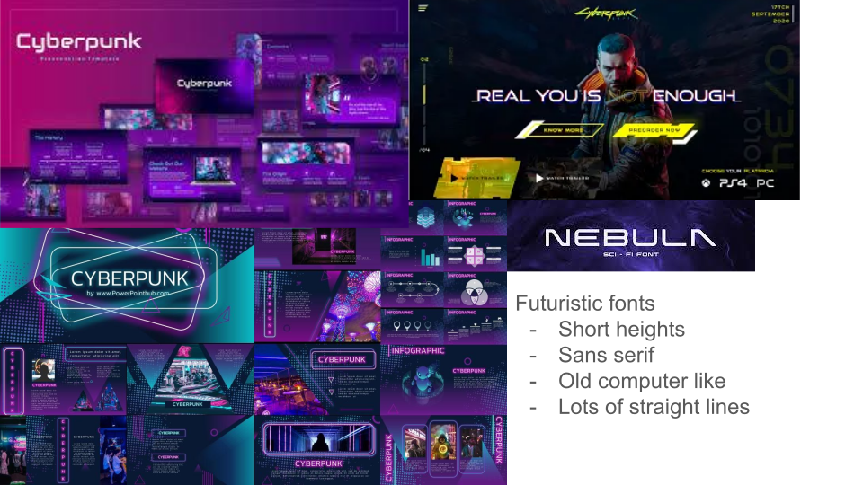

# Visual Design Study
## Color Study

## Font Study

# User Journey

Angela is an aspiring musician who loves to make music. She has some experience with music theory and playing piano, but would like to up her game when it comes to creating chord progressions. She opens Chordify, your one stop shop for creating and experimenting with chord progressions. On the home pages, she enters the name of her new progression and clicks enter to create a new progression page. She adjusts the suggestion preferences to have the progression in D minor, Pop genre, and intermediate complexity. For a starting off point, she clicks generate progression to generate entire progressions. She realizes from the error  pop up that she has not added any slots to indicate how long she wants the progression to be, so she creates 4 empty slots for a 4 chord progression and clicks generate progression again. She plays all three of the generated progression and selects the first one because she like the sound of it the best. She doesn't like the third chord in the progression, so she selects the third chord and clicks the backspace once to delete the chord from the slot. While the third slot is selected, she clicks generate chord to get chord suggestions for that slot. She plays many of the suggested chords by clicking on them. At this point, she would like to know what the chords sound like if they were played on the guitar, so she changes the instrument to guitar. She would also like the chords to play a little longer, so she changes the seconds/chord from 1 second to 1.5 seconds. She select her favorite chord from the suggestions by double clicking that chord while the third slot is selected, and it populates in the progression. She plays the overall progression a couple times over by toggling the play and then loop button and decides that she would like to add another chord to the progression. She adds a new slot by clicking the plus button, and drags it to the second spot in the progression. Here, she knows what chord she would like so she manually types in the chord. She plays the progression and is satisfied with it. She would like to rename the progression, so she doulble clicks on the progression name and updates the name. She would like to work on a previous progression, so she clicks on the progression name edits that progression. She would like to clean up the work space, so in the progression sidebar she clicks the delete button form a previous progression and deletes it. She wants to create another progresssion, so she clicks new progression in the side bar and starts the process over again.

# Screen Recording
<video src="https://github.com/user-attachments/assets/81243d3c-a178-4e94-839d-9fd2f74fb515" width="640" controls></video>
